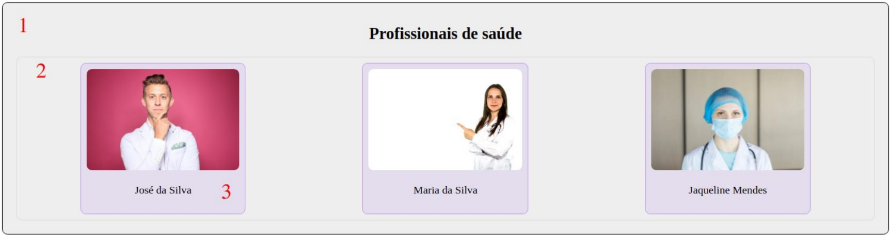

# Programação para Dispositivos Móveis
## 5º Semestre do curso de *Análise e Desenvolvimento de Sistemas*
## React Introdução
# Exercício 1 - React - Introdução

Crie uma aplicação ReactJS com um único componente que exibe o conteúdo ilustrado pela Figura 1.1.

## Siga as seguintes instruções:   
### 1.1 Defina os estilos do elemento “1” usando uma função que devolve um objetoJSON.   
### 1.2 Defina os estilos do elemento “2” usando CSS In-line.   
### 1.3 Defina os estilos do elemento “3” usando uma classe CSS definida em um arquivoà parte.   
### 1.4 Defina os nomes dos médicos em um objeto JSON.    
### 1.5 Faça o download da primeira foto e armazene-a em uma pasta chamada images,subpasta de src. Pesquise como ela pode ser acessada usando uma instrução import.   
### 1.6 Faça o download da segunda foto e armazene-a na pasta public, que já existe noprojeto. Pesquise como ela pode ser acessada usando a propriedade env do objetoglobal process do NodeJS: process.env.nomeDaFoto.jpg.   
### 1.7 Acesse a terceira foto usando um link https comum.
#
# Resultado do exercício

